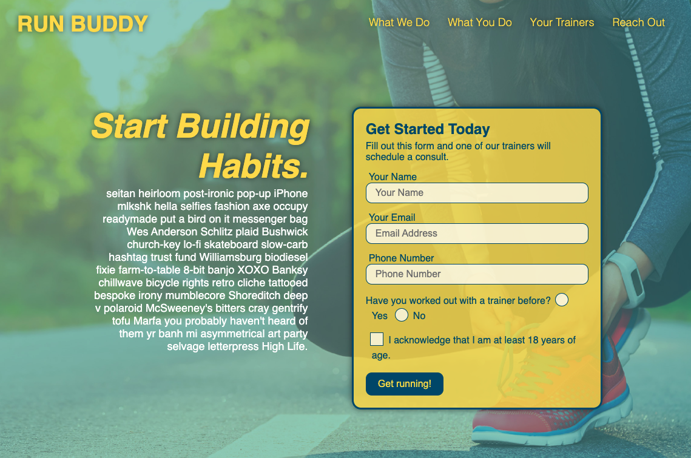

# Run-Buddy
A service that lets runners sign up for personal training.

## table of contents 
- [Purpose](#purpose)
- [Technologies-Used](#Technologies-Used)
- [Getting-started](#Getting-started)
- [Contact](#Contact)
- [Contribution](#contribution)

## Purpose 
Run-buddy is a service that lets runners link up with personal trainers. This app allows users to sign up with personal trainers through a form on the landing page. The site also provides information about what the company is, who the trainers are, and a contact section. The purpose of this app was to build the initial landing page for such a site using only html and css and without javascript functionality. 

## Technologies-Used
- html
- css

## Getting-started
To view the application you can either clone the repo and open the html page on your prefered browser or you can go to the following link to view the deployed application https://lernantino.github.io/run-buddy/. 

- sample of app

## Contact
If you have any questions feel free to contact me through my [Github](https://github.com/Araceli4690).

## Contribution
Made with ❤️ by Araceli

